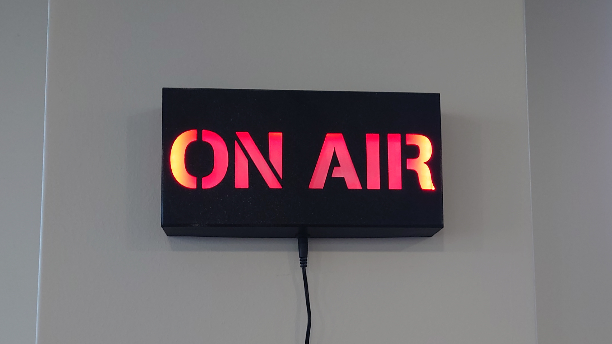
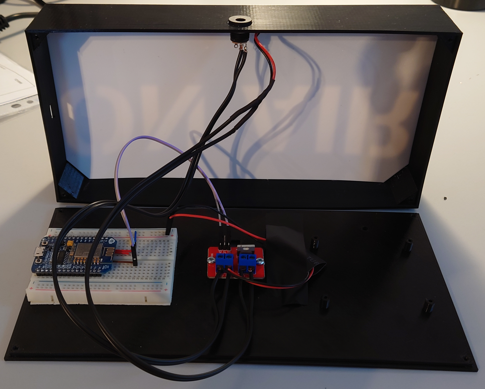

# (Somewhat) Intelligent do-not-disturb sign



This repo contains 3D models and the code for a small tinker project: an
illuminated "ON AIR" sign that connects to WiFi and can be turned on/off over
the network.

The basic idea was to be able to let people around me know that I am on a video
call so they don't disturb me. I wanted something that is easily noticed, so an
illuminated sign is great for that and I thought the famous radio "ON AIR"
message would be a good fun (ha ha). I also wanted to be able to control it
programatically, so I can automate it to illuminate when I have a zoom call
active on my laptop.

Hence I have created this 3D printed sign, with an ESP8266 controller, as that's
the cheapest chip I know that has WiFi. The controller runs a simple program
with mDNS responder, so I can access it using a hostname rather than an IP that
can change, and a simple HTTP API, so I can send the ON and OFF commands to it
over the network.

For reference and for anyone who might want to build a similar sign, here's a
simple tutorial.

**DISCLAIMER:** I use Ubuntu Linux on my laptop, and Zoom desktop client pretty
much exclusively for video calls. This is a "works for me" project so you will
almost certainly need to adapt it to your needs.

## Parts list

  * [ESP8266 controller board (NodeMCU or similar)](https://www.gme.cz/esp12n-v1-0-nodemcu-lua267-esp8266-cp1202)
  * [MOSFET IRF520 module](https://www.gme.cz/modul-s-n-channel-mosfet-irf520)
  * [12V 1500mA power supply with 5.5x2.1mm jack](https://www.gme.cz/napajeci-adapter-sitovy-12v-1500ma-5-5-2-1mm-b-vigan)
  * [DC jack socket 5.5x2.1mm - panel mount](https://www.gme.cz/napajeci-souosy-konektor-ds-223b)
  * [DC-DC step-down converter 12V to 5V](https://www.gme.cz/step-down-napajeci-modul-1-17v-1a-miniaturni)
  * [Red LED strip 12V](https://www.gme.cz/led-pasek-120led-m-red-9-6w-m-ip65-3-m)
  * 2.2x6.5mm screws
  * Optional: [Small breadboard](https://www.gme.cz/nepajive-kontaktni-pole-zy-60)

You will also need soldering equipment and a multimeter (and obviously a 3D
printer).

## 3D print

The sign consist of three 3D printed parts:

- [case front side](3d/stl/onair-front.stl)
- [case back side](3d/stl/onair-back.stl)
- [reflection screen](3d/stl/onair-reflection-screen.stl)

The back side has 2 standoffs for the MOSFET board and 4 standoffs for Raspberry
Pi (that I didn't use in the end). It has an attachment for a [wall mount like
this](https://www.obi.cz/nastenne-haky/lux-nastenny-hacek-plastovy-40-mm-bily-2-ks/p/4949582).

I recommend printing the case using black PETG filament and the screen using
white PETG filament. If you use Prusa i3MK3S(+) printer with PETG Prusament,
you might be able to use [my gcode](3d/gcode) directly.

If you like to modify the design, see the [OpenSCAD source](3d/openscad/onair.scad).
In such case, you will also need to install a stencil font, I have used
[Stencilia Regular](https://www.dafont.com/stencilia.font).

**Note:** I have used a spare NodeMCU (ESP8266) board with breadboard pins
already soldered that I didn't feel like desoldering. So I have affixed a small
breadboard to the back side of the sign case and plugged the board in. If you
have a controller board without breadboard pins, it would be better to add
standoffs for your board instead, attach the board with screws and solder the
wires directly to the pins on the board. If you do so, don't forget to update
the position of USB access socket in the case front side model!

## Assembly & electronics



Steps to build the project:

1. Stick the self-adhesive LED stripe to the inner perimeter of the front case,
   near the front. It should form a "loop" around the letters. Begin from the
   bottom middle. Cut the excessive LED stripe with pliers.
2. Insert the reflection screen, make sure the LED strip wires lead to the back,
   there is a cut-out in the screen for the wires.
3. Affix the power jack socket to the opening in the bottom of the front case.
   Solder a pair of wires to the power jack. They should be long enough to have
   the top and bottom case sides next to each other while being connected by
   the wires. Extend the LED strip wires if needed so they are the same length.
4. (Skip this step if you don't use breadboard) Plug the controller board to the
   bread board, near one end, MicroUSB port facing outwards. Affix the
   self-adhesive breadboard to the middle-left of the back side of the case,
   with controller MicroUSB port pointing left (before sticking it down, attach
   front side to check if the MicroUSB port is aligned with the opening). See
   the above picture for details.
5. Attach the MOSFET board to the standoffs in the middle of the back side with
   screws. Attach the LED strip wires to the screw terminal marked "OUT". (Pay
   attention to polarity!).
6. Solder a pair of short wires to the step-down converter (IN side). Solder
   another pair of wires to the OUT side - since I use breadboard to connect the
   controller, I used wires with breadboard (dupont) pins at the other hand, if
   you plan to solder the wires to the controller, use standard wires. **Do not
   connect controller yet (we have to set the right voltage first)!**
7. Attach the wires from power socket, _together_ with the step-down board IN
   wires, to the IN screw terminal on the MOSFET board.
8. Attach multimeter to the loose ends of the step-down board OUT wires to
   measure voltage. Plug in the 12V power supply. Using a precision screwdriver,
   adjust the potentiometer on the step-down board so the output voltage of the
   step-down is just above 5V. Disconnect the power supply and insulate the step
   down board (e.g. using an electrical tape).
9. Attach the step-down board OUT wires to the controller 5V and GND pins.
   Attach the GND pin on the MOSFET board to controller's GND and SIG pin on the
   MOSFET board to controller's GPIO pin (I have used GPIO 4). Use dupont cables
   if you use breadboard, otherwise solder it.
9. Close the case and screw it together.

## Controller software

Use [PlatformIO](https://platformio.org/) to open this repo. Save the [config.h
template](src/config.h.template) as `src/config.h` and configure WiFi settings,
the device's hostname and API users. Connect the sign to your laptop using a
MicroUSB cable. Plug in the power source to the device. Build the project and
program the board with it. In case of issues, check [PlatformIO
documentation](https://docs.platformio.org/en/latest/).

If all is OK, you should be able to access your sign within your WiFi network
using hostname `onair.local` (if you haven't changed it in the config) using
your browser. Use http://onair.local/on link to turn the sign on and
http://onair.local/off to turn it off. Credentials from the config will be
required.

**Note:** If the hostname doesn't work, it might be that mDNS resolution doesn't
work on your device (for example, it doesn't work on Android phones), try with
the IP address: keep USB cable attached, open serial console (115200 baud rate)
and restart the device - The obtained IP address will be printed on the console.

To turn the sign on/off from command-line using curl (with default values in
config):

```shell
curl --digest -u admin:admin -v onair.local/on
curl --digest -u admin:admin -v onair.local/off
```

## Client script

The main idea of this project was to have the sign automatically illuminate
when I am on a call. For that, I've created a [simple script](client/onair-watch)
that checks if a window manager window with a title "Zoom Meeting" or "Zoom
Webinar" - if so, turn the sign on and keep sending a keepalive "ON" commands.
Otherwise, turn it off. There is a [systemd unit](client/onair.service) to make
this running as a service. Known issue: when I am sharing a screen, the meeting
window disappears and so the sign is turned off - I still need to look into that.

Another "trigger condition" for the sign you can consider is whether your webcam
is in use. On Linux, that can be checked by running following command:

```
lsmod | grep '^uvcvideo\b'
```

The second number next to `uvcvideo` module name is "Used by", number of
programs currently using the module. If it is 0, the module (and hence the
webcam) is not in use, otherwise it is. Obvious disadvantage of this approach is
that if you have a call with video disabled, it will not trigger the condition.
